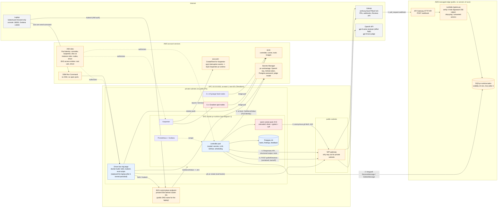

# Diagrams

Two views. Renders on GitHub (Mermaid). Read `ONBOARDING.md` first for the vocabulary.

A note on terms: there is no central "kubelet node". **kubelet** is the per-node agent; the central part is the **control plane** (kube-apiserver, etcd, kube-scheduler, kube-controller-manager), which EKS runs for us outside our nodes. Every arrow into the control plane below is an HTTPS call to the API server.

---

## 1. Inside the cluster: what runs where and who talks to whom

```mermaid
flowchart TB
  %% ============ CONTROL PLANE (AWS-managed) ============
  subgraph CP["EKS control plane  (AWS-managed, not on our nodes; reachable at private ENIs behind the cluster security group)"]
    direction LR
    API["kube-apiserver<br/>the only entry point: every object read/write"]
    ETCD[("etcd<br/>desired + observed state")]
    SCHED["kube-scheduler<br/>assigns Pending pods to nodes by requests, nodeSelector"]
    KCM["kube-controller-manager<br/>ReplicaSet, Deployment, StatefulSet, Job, PVC controllers"]
    API <--> ETCD
    SCHED --> API
    KCM --> API
  end

  %% ============ CLIENTS OF THE API ============
  subgraph CLIENTS["API clients"]
    direction LR
    KUBECTL["kubectl (laptop, driver box)<br/>IAM identity via EKS access entry"]
    HELM["helm upgrade --install<br/>renders deploy/chart and applies it"]
    TF["Terraform<br/>creates cluster, node group, addons, Pod Identity associations"]
  end
  KUBECTL --> API
  HELM --> API
  TF --> API

  %% ============ FIXED NODE GROUP ============
  subgraph FLOOR["Managed node group: 3 x m7g.large Graviton, on-demand, label pr-runtime/pool=general, private subnets"]
    direction TB
    subgraph NODE1["node (one of three; every node looks like this)"]
      direction TB
      KUBELET["kubelet<br/>pulls specs from API, starts containers, runs probes, reports status"]
      CONTAINERD["containerd<br/>pulls images from ECR, runs containers"]
      KPROXY["kube-proxy (DaemonSet)<br/>programs Service virtual IPs"]
      CNI["aws-node VPC CNI (DaemonSet)<br/>gives each pod a real VPC IP<br/>+ network-policy eBPF agent"]
      PIA["eks-pod-identity-agent (DaemonSet)<br/>hands AWS creds to pods with an association"]
      NEXP["node-exporter (DaemonSet)"]
      KUBELET --> CONTAINERD
    end

    subgraph NS_PRR["namespace pr-runtime"]
      direction TB
      CTRL_DEP["Deployment controller, replicas=1<br/>nodeSelector pool=general<br/>SA controller + Role: get/list/watch/delete pods"]
      CTRL["pod controller<br/>FastAPI: SQS consume, rank, admit,<br/>assign, LLM review, GitHub post,<br/>/metrics /api SSE, serves console<br/>readOnlyRoot, /tmp emptyDir holds git mirror"]
      CTRL_SVC["Service controller (ClusterIP :8000)"]
      RUN_DEP["Deployment runner, replicas=N (4 idle)"]
      RUN_RS["ReplicaSet<br/>keeps N pods alive; replaces deleted ones = warm-pool refill"]
      RUN1["runner pod (idle, Ready)<br/>no SA token, no secrets,<br/>readOnlyRoot, /work emptyDir,<br/>drop ALL caps, limits 1 CPU / 1Gi<br/>readiness: 200 idle, 503 after a task"]
      RUN2["runner pod (idle, Ready)"]
      RUN3["runner pod (busy, NotReady)"]
      NP["NetworkPolicy runner-egress<br/>ingress: controller:8080 only<br/>egress: controller:8000, kube-dns:53, *:443 except 10/8 and IMDS"]
      PG_SS["StatefulSet postgres, replicas=1<br/>nodeSelector pool=general"]
      PG["pod postgres-0<br/>postgres:16-alpine"]
      PG_SVC["Service postgres (headless)"]
      PVC["PVC data-postgres-0 8Gi<br/>StorageClass gp3"]
      SEC["Secret pr-runtime-env<br/>(Postgres password only)"]
      CM1["ConfigMap eval-results"]
      CM2["ConfigMap guidelines"]
      SM["ServiceMonitor controller<br/>scrape /metrics every 5s"]
      CTRL_DEP --> CTRL
      CTRL_SVC --> CTRL
      RUN_DEP --> RUN_RS
      RUN_RS --> RUN1
      RUN_RS --> RUN2
      RUN_RS --> RUN3
      NP -.applies to.-> RUN1
      NP -.applies to.-> RUN2
      NP -.applies to.-> RUN3
      PG_SS --> PG
      PG_SVC --> PG
      PG --> PVC
      SEC -. env .-> PG
      CM1 -. mount /eval-results .-> CTRL
      CM2 -. mount /guidelines .-> CTRL
      SM -. selects .-> CTRL_SVC
    end

    subgraph NS_SYS["namespace kube-system"]
      direction LR
      COREDNS["CoreDNS (Deployment)<br/>svc.namespace.svc.cluster.local"]
      KARP["Karpenter (Deployment)<br/>watches Pending pods, launches/terminates EC2"]
      EBSCSI["ebs-csi-controller<br/>turns PVCs into EBS volumes"]
    end

    subgraph NS_MON["namespace monitoring"]
      direction LR
      PROM["Prometheus (StatefulSet)<br/>5s scrape, PromQL"]
      GRAF["Grafana (Deployment)<br/>anonymous viewer, dashboard from ConfigMap"]
      KSM["kube-state-metrics<br/>pod/node objects as metrics"]
      PROM --> GRAF
    end

    subgraph NS_KEDA["namespace keda (baseline only, ScaledJob disabled)"]
      KEDA["keda-operator<br/>would spawn one Job per SQS message"]
    end
  end

  %% ============ BURST NODES ============
  subgraph BURST["Karpenter burst capacity: 0..n nodes, label pr-runtime/pool=burst, spot preferred (c7g/m7g/r7g/m8g/c8g), consolidated 60s after idle"]
    direction TB
    NODEB["node (spot c7g.2xlarge last time)<br/>same DaemonSets as the floor"]
    RUNB["runner pods overflow here<br/>(controller and postgres never do: nodeSelector)"]
    NODEB --> RUNB
  end
  NODEPOOL["NodePool runner-burst + EC2NodeClass runner-arm64<br/>(CRDs: the rules)"]
  NODECLAIM["NodeClaim (one per burst node)"]

  %% ============ CONTROL FLOWS ============
  KUBELET <-- "watch pod specs, report status, probe results" --> API
  SCHED -- "binds Pending pod to a node" --> KUBELET
  CTRL -- "list runner pods (Ready, IP, age)<br/>delete pod after one task" --> API
  KARP -- "watch Pending pods" --> API
  KARP -- "CreateFleet / TerminateInstances (Pod Identity role)" --> EC2["EC2 API"]
  KARP --> NODECLAIM
  NODEPOOL -.-> KARP
  NODECLAIM --> NODEB
  KCM -- "ReplicaSet sees 3/4 pods, creates one" --> RUN_RS
  EBSCSI -- "CreateVolume / Attach" --> EBS["EBS"]
  PVC --> EBSCSI

  %% ============ DATA FLOWS ============
  CTRL -- "POST http://podIP:8080/task" --> RUN1
  RUN3 -- "POST /result/{id} via Service DNS" --> CTRL_SVC
  CTRL -- "SQL" --> PG_SVC
  PROM -- "GET /metrics" --> CTRL_SVC
  KSM --> PROM
  RUN3 -- "git fetch github.com:443 (anonymous)" --> NAT["NAT gateway -> internet"]
  CTRL -- "OpenAI, GitHub API, SQS, Secrets Manager" --> NAT
  CNI -. "assigns VPC IPs to all pods" .-> RUN1
  PIA -. "AWS creds for controller, karpenter, ebs-csi" .-> CTRL
  COREDNS -. "name resolution for every pod" .-> RUN3

  classDef aws fill:#fff4e0,stroke:#d97706,color:#111;
  classDef untrusted fill:#fde8e8,stroke:#b91c1c,color:#111;
  classDef trusted fill:#e8f3ff,stroke:#1d4ed8,color:#111;
  class API,ETCD,SCHED,KCM,EC2,EBS,NAT aws;
  class RUN1,RUN2,RUN3,RUNB untrusted;
  class CTRL,CTRL_DEP,CTRL_SVC trusted;
```

Legend: orange = AWS-managed; red = untrusted (runs PR code); blue = trusted control plane of *our* system. Dashed = "applies to / mounts / provides", solid = a call or data flow.

What to notice:
- The **kubelet** on each node never decides anything; it does what the API server's desired state says and reports back. The **scheduler** decides placement; **controllers** (ReplicaSet etc.) decide counts; **Karpenter** decides nodes.
- Our controller is just another API client: it lists runner pods and deletes them. Nothing else in Kubernetes knows about "tasks".
- The runner pod has no arrows to the API server, no secrets, and its only outbound paths are the controller Service, DNS, and port 443 through the NAT.

---

## 2. The whole system: from a GitHub push to a review comment

The numbered edges are the life of one PR: webhook in at the edge (1), controller pulls it from the queue (2), a runner fetches and tests the branch (3), the controller asks the model (4) and posts the review (5). Step 0 happens once per controller boot.

Trust boundaries, outermost in:
1. **Internet → AWS edge**: API Gateway and Lambda are the only public surface, and Lambda rejects anything without a valid HMAC before it touches the queue.
2. **Edge → VPC**: the only way in is the controller *pulling* from SQS over the NAT. No inbound path exists.
3. **Controller → runner**: the controller has every secret; the runner has none, no Kubernetes token, and an egress allow-list.
4. **Laptop / driver → cluster**: IAM-authenticated `kubectl` to the API endpoint; SSM to the driver. No SSH keys anywhere.

Everything inside the VPC is created by `infra/*.tf`; everything inside the cluster by `deploy/chart` plus three third-party Helm charts (kube-prometheus-stack, KEDA, Karpenter).
