# pr-runtime walkthrough: how this specific cluster works

Project-specific. For general Kubernetes, read CRASH-COURSE.md first. One idea per section, one small diagram each, every example is an object you can `kubectl get` in our cluster. Skip anything you already know. `ONBOARDING.md` is the reference version; `DIAGRAMS.md` has the big pictures.

---

## 0. The only mental model you need

Kubernetes is a **database of desired state** plus **loops that make reality match it**. You never tell it "start a container." You write "I want 4 of these" and something reconciles.

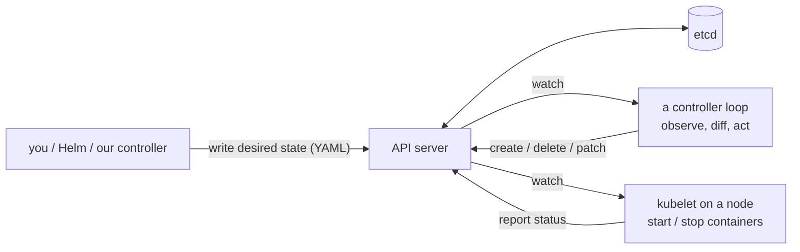

Everything below is a specific instance of this loop. Slurm analogy: the controller daemon plus the power-save scripts, generalized to every kind of object.

---

## 1. Control plane vs nodes: who does what

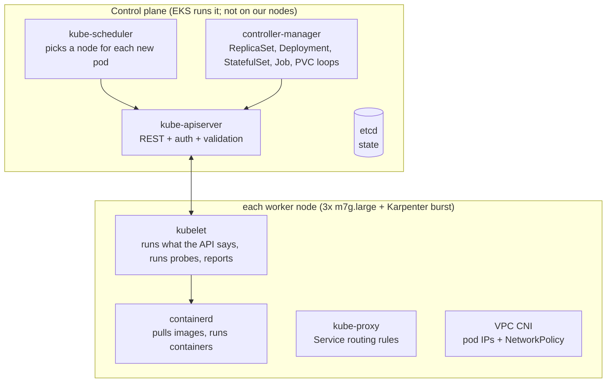

- **kubelet** decides nothing. It is told "run pod X" and does it.
- **scheduler** decides *where*. **controllers** decide *how many*. **Karpenter** (section 9) decides *how many nodes*.
- Our controller pod is just another API client. It lists runner pods and deletes them. Kubernetes has no idea what a "task" is.

### Life of a pod creation

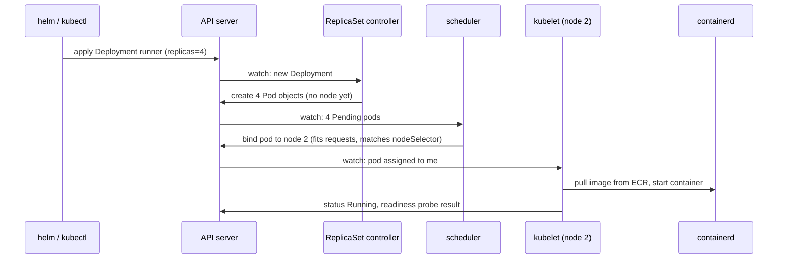

That is the whole system. Every other object is a variation on "someone watches, someone acts."

---

## 2. Deployment, ReplicaSet, Pods: our warm pool

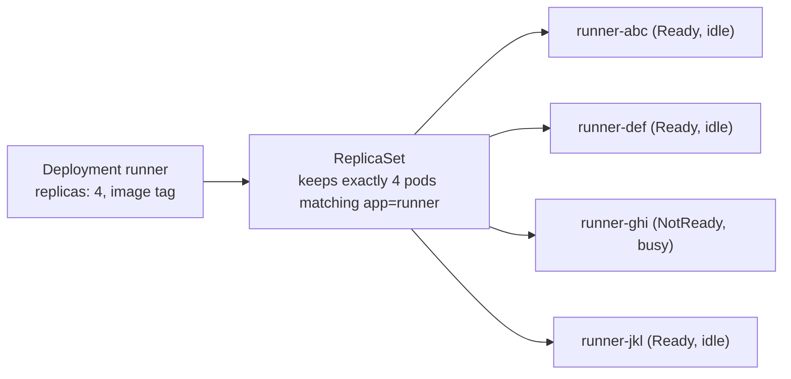

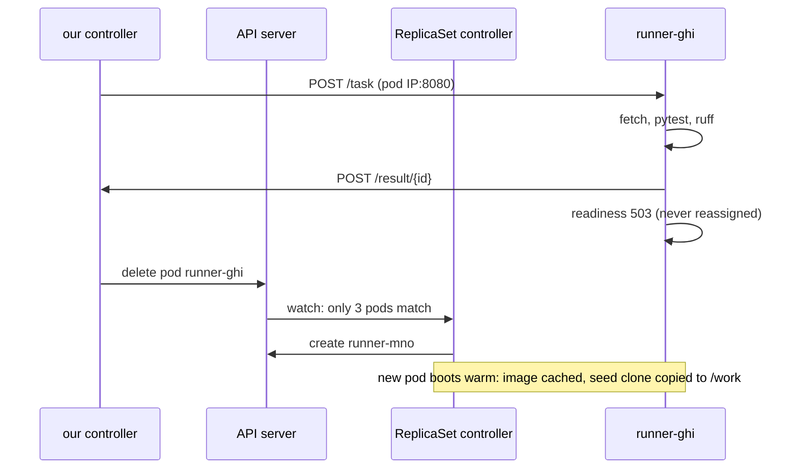

Why delete instead of letting the process exit: a Deployment pod has `restartPolicy: Always`, so an exited container restarts **in the same pod** with the same dirty `/work`. Pod *deletion* is the ephemeral unit; the ReplicaSet gives us the refill for free.

Other pod-makers you will see: **StatefulSet** (Postgres: stable name `postgres-0`, its own disk), **DaemonSet** (one per node: CNI, kube-proxy, pod-identity agent), **Job** (run once: the KEDA baseline).

---

## 3. Readiness probe as the idle flag

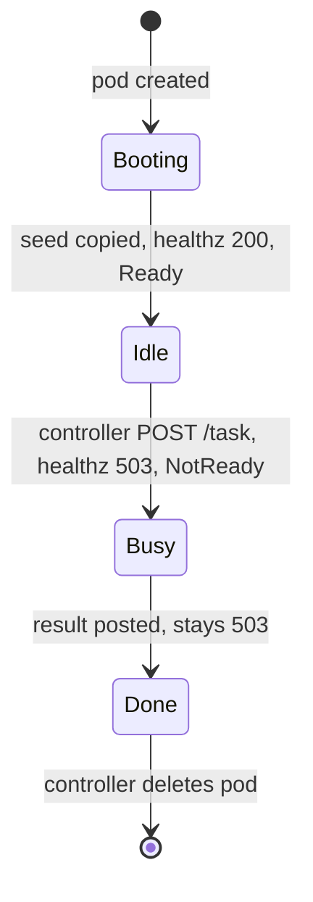

The controller's definition of "idle runner" = **Ready and not in my assigned set**. No labels, no extra state. Kubelet runs the probe every 2s; readiness also controls whether a pod receives Service traffic (irrelevant for runners, they have no Service; crucial for the controller, which does).

---

## 4. Requests, limits, and where pods land

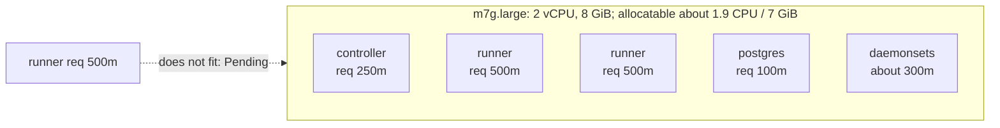

- **requests** = what the scheduler reserves. Sum must fit the node's allocatable.
- **limits** = cgroup ceiling. CPU over limit is throttled; memory over limit is OOM-killed.
- Pending pods are the signal Karpenter reacts to (section 9).
- `nodeSelector: pr-runtime/pool: general` pins controller + Postgres to the fixed nodes. Runners have none, so they float onto burst nodes.

---

## 5. Networking in five packets

### 5a. Pod IPs: every pod is a real VPC address

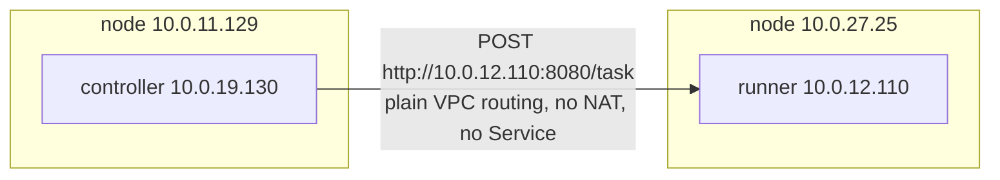

The **VPC CNI** hands pods secondary IPs from the node's ENI. So our controller can talk to a specific runner by IP, which is exactly what it wants: *this* pod, not "any runner." Pod IPs change on replacement; the controller re-lists every tick.

### 5b. Services: a stable name over moving pods

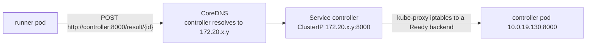

- Service = virtual IP + DNS name + label selector. kube-proxy on every node rewrites the virtual IP to a Ready pod IP.
- `postgres` is **headless** (`clusterIP: None`): DNS returns the pod IP directly. Normal for StatefulSets.
- Service types: ClusterIP (ours, internal only), NodePort, LoadBalancer (would create an AWS LB; we have none, so nothing in the cluster is reachable from outside).

### 5c. Out to the internet: private subnets and NAT

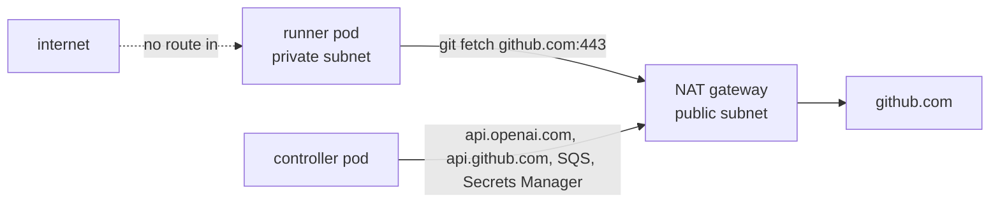

Nodes have no public IPs. Inbound is impossible by construction; outbound goes through one NAT gateway. The webhook never enters the cluster: the controller **pulls** from SQS.

### 5d. NetworkPolicy: the runner's firewall

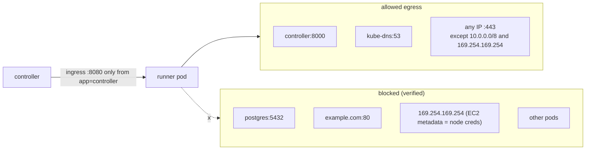

Needs CNI enforcement (we turned on `enableNetworkPolicy` in the VPC CNI; an eBPF agent on each node applies it). Honest gap: port 443 to any public host, because GitHub's IPs are not pinnable.

### 5e. Getting in from your laptop

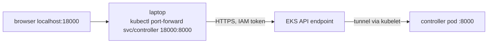

No public endpoint for the console or Grafana. `port-forward` is an authenticated tunnel through the API server. It dies when the pod is replaced or the laptop sleeps (most of our "it hung" moments).

Inside the VPC the API endpoint resolves to **private** IPs behind the **cluster security group**, which is why the driver box needed a 443 rule added (`infra/driver.tf`).

---

## 6. Storage: PVC to PV to EBS

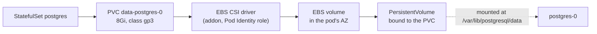

- **emptyDir** = scratch tied to the pod's life (runner `/work`, controller `/tmp` with the git mirror).
- **PVC** = a claim ("8Gi gp3"); the **StorageClass** names the driver; the **CSI driver** creates and attaches the real disk.
- EBS is AZ-bound: `postgres-0` can only be rescheduled in its AZ. RDS is the prod answer.

---

## 7. Config and secrets: three sources, one rule

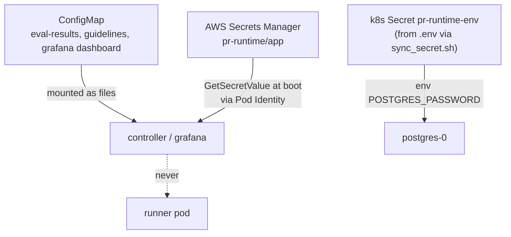

Rule: the **runner gets nothing**. The controller reads one AWS secret at boot (no k8s Secret mounted into it). Postgres still uses a k8s Secret for its own password.

---

## 8. Identity: two systems, keep them apart

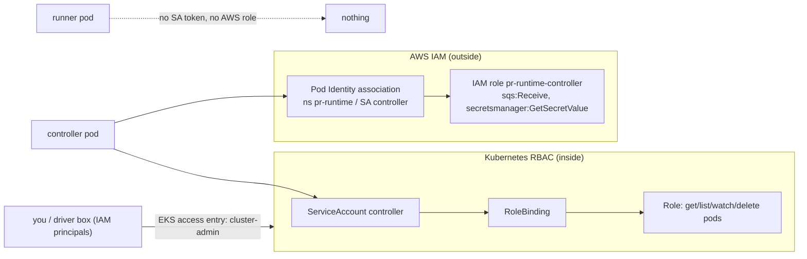

- RBAC answers "may this pod call the Kubernetes API?" Our controller: pods only, one namespace.
- Pod Identity answers "may this pod call AWS?" (IRSA is the older OIDC-token way; same idea.)
- Access entries answer "may this IAM user or role run kubectl?"

---

## 9. Autoscaling: three different things

| Tool | Scales | Signal | Us |
|---|---|---|---|
| HPA | pods | CPU/memory | not used |
| **KEDA** | pods / Jobs | external metric (SQS depth, ...) | cold-start baseline only, disabled |
| **Karpenter** | **nodes** | Pending pods | burst capacity |
| our controller | tasks onto pods | its own queue | the actual scheduler of work |

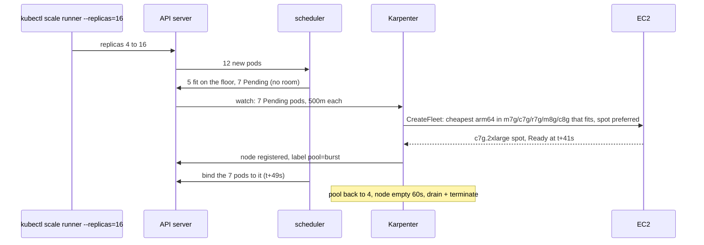

Spot reclaim: AWS posts a 2-minute warning to Karpenter's SQS interruption queue; Karpenter drains early; a busy runner's pod vanishes; our controller notices on the next tick and requeues the task (`prr_tasks_lost_total{reason=pod_lost}`). Measured: attempt 2 posted in 50s, nothing failed.

Slurm mapping: NodePool = partition/nodeset rules; Karpenter = ResumeProgram/SuspendProgram with the machine type chosen per request; consolidateAfter = SuspendTime; `kubectl drain` = node going DRAIN.

---

## 10. Helm, CRDs, operators

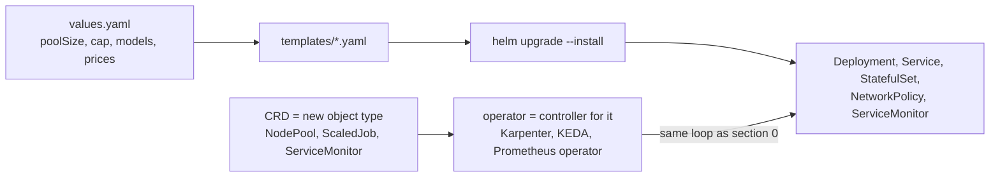

Helm is templating plus a release record; nothing magic. A CRD plus its operator is how Kubernetes grows new nouns: we installed three (Prometheus operator, KEDA, Karpenter) and wrote none.

---

## 11. Observability path

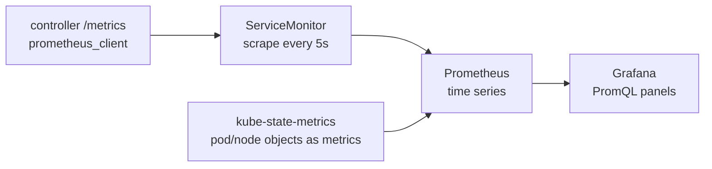

PromQL you will see: `max(prr_tasks_pending)` (gauge, collapsed across restarts), `sum(rate(prr_tasks_total[1m]))` (counter to rate), `histogram_quantile(0.95, sum(rate(prr_time_to_comment_seconds_bucket[2m])) by (le))` (p95).

---

## 12. One PR, end to end

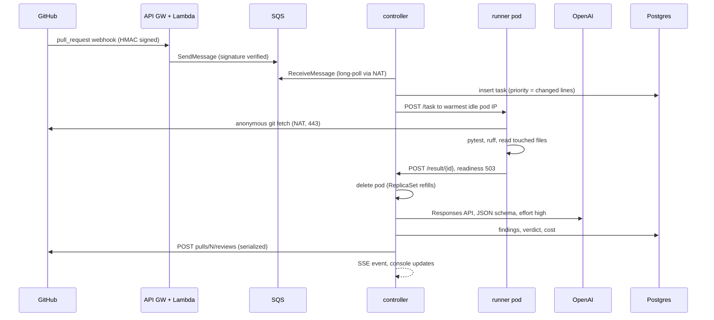

Timing, quiet: assigned under 1s, runner about 4s, LLM about 15s, post about 2s, total about 24s. Under a 56-PR burst with cap 4: p50 68s, p95 200s; the queue wait and the LLM stage dominate, never the runners.

---

## 13. What broke, and the Kubernetes lesson in each

| What happened | Lesson |
|---|---|
| Exit-after-one restarted in place | Deployment pods restart containers; delete the pod to get a fresh one |
| Controller got drained with a spot node | Elastic nodes need `nodeSelector`/affinity for anything stateful or control-plane |
| Busy pod vanished, task waited 300s | Watch the live pod set; do not rely on deadlines for node loss |
| 18 reviews in flight when the controller restarted | In-memory state dies; reconcile from the database on boot |
| Driver box could not reach the API | In-VPC traffic hits the private endpoint behind the cluster SG |
| `port-forward` "hangs" | It is bound to one pod; dies on rollout |
| One cap for runners and LLM calls | Stages with different resource profiles need separate concurrency |
| Spot launch failed | Account-level prerequisites (service-linked role, quotas) come before any scheduler logic |

---

## 14. Twenty questions, one line each

1. What does kubelet do? Runs the pods the API server assigns to its node, runs probes, reports status. Decides nothing.
2. What places a pod on a node? kube-scheduler, by requests plus nodeSelector/affinity/taints.
3. What keeps 4 runners alive? The ReplicaSet behind the Deployment.
4. How does the controller know a runner is idle? Pod Ready (probe 200) and not in its assigned set.
5. Why delete the pod instead of exiting? `restartPolicy: Always` restarts in place with the dirty workdir.
6. How does the controller reach a runner? Pod IP from the API, HTTP to :8080. Pods have real VPC IPs.
7. How does the runner reach the controller? Service DNS `controller`, ClusterIP, kube-proxy, the pod.
8. Why no LoadBalancer Service? Nothing in the cluster is public; the webhook goes to API Gateway, Lambda, SQS, and the controller pulls.
9. What stops a runner from reading Postgres or EC2 metadata? NetworkPolicy, enforced by the VPC CNI eBPF agent. Verified.
10. What is the hole in it? Any host on 443.
11. How does the controller get AWS credentials? Pod Identity association to an IAM role, via the node agent.
12. How does it get Kubernetes permissions? ServiceAccount plus Role (pods: get/list/watch/delete) in one namespace.
13. How does kubectl from the driver box authenticate? IAM role, EKS access entry, cluster-admin.
14. What is a PVC? A claim for storage; the EBS CSI driver turns it into an AZ-bound EBS volume.
15. What does Karpenter react to? Pending pods. It picks the cheapest instance that fits them and consolidates idle nodes after 60s.
16. What happens on a spot reclaim mid-task? Interruption queue, drain, pod vanishes, controller requeues immediately.
17. KEDA vs Karpenter? KEDA scales pods/Jobs from external metrics; Karpenter scales nodes. We kept KEDA only as the cold-start baseline.
18. What is a CRD? A new object type; its operator is the controller loop that acts on it (NodePool, ScaledJob, ServiceMonitor).
19. What does Helm do? Templates YAML and records the release. `helm template` shows what it applies.
20. If the controller dies mid-review? The SQS message was already deleted; the row is in Postgres; `reconcile()` on boot resumes reviewing tasks and requeues running ones. Measured: 17 reviews resumed.
